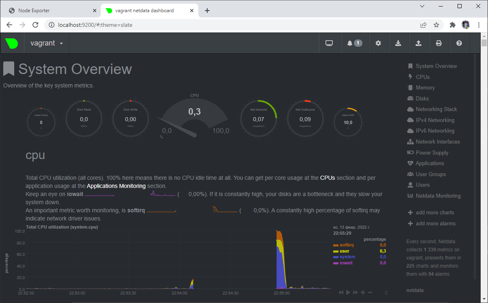

# Devops Netology

## Комментарии по ДЗ "3.4. Операционные системы, лекция 2"
1) На лекции мы познакомились с [node_exporter](https://github.com/prometheus/node_exporter/releases). В демонстрации его исполняемый файл запускался в background. Этого достаточно для демо, но не для настоящей production-системы, где процессы должны находиться под внешним управлением. Используя знания из лекции по systemd, создайте самостоятельно простой [unit-файл](https://www.freedesktop.org/software/systemd/man/systemd.service.html) для node_exporter:

    * поместите его в автозагрузку,
    * предусмотрите возможность добавления опций к запускаемому процессу через внешний файл (посмотрите, например, на `systemctl cat cron`),
    * удостоверьтесь, что с помощью systemctl процесс корректно стартует, завершается, а после перезагрузки автоматически поднимается.

####
Устанавливаем node_exporter как:
```bash
vagrant@vagrant:/$ cd /tmp
vagrant@vagrant:/$ curl -LO https://github.com/prometheus/node_exporter/releases/download/v0.18.1/node_exporter-0.18.1.linux-amd64.tar.gz
vagrant@vagrant:/$ tar -xvf node_exporter-0.18.1.linux-amd64.tar.gz
vagrant@vagrant:/$ sudo mv node_exporter-0.18.1.linux-amd64/node_exporter /usr/local/bin/
vagrant@vagrant:/$ sudo useradd -rs /bin/false node_exporter
```
Указываем конфигурационный файл:
```bash
vagrant@vagrant:/$ sudo vim /etc/systemd/system/node_exporter.service
```
с содержимым:
```shell
[Unit]
Description=Node Exporter
After=network.target

[Service]
User=node_exporter
Group=node_exporter
Type=simple
ExecStart=/usr/local/bin/node_exporter
EnvironmentFile=/etc/sysconfig/node_exporter

[Install]
WantedBy=multi-user.target
```
Создадим Environment file:
```bash
vagrant@vagrant:~$ sudo mkdir -p /etc/sysconfig
vagrant@vagrant:~$ sudo vim /etc/sysconfig/node_exporter
```
с содержимым:
```shell
OPTIONS="--var 1000"
```

Перезапускаем системный демон и включаем службу node_exporter:
```shell
vagrant@vagrant:/usr/local/bin$ sudo systemctl daemon-reload
vagrant@vagrant:/usr/local/bin$ sudo systemctl start node_exporter
```
Проверяем, что запуск прошёл успешно, и что node_exporter в активном состоянии:
```shell
vagrant@vagrant:/usr/local/bin$ sudo systemctl status node_exporter
● node_exporter.service - Node Exporter
     Loaded: loaded (/etc/systemd/system/node_exporter.service; disabled; vendor preset: enabled)
     Active: active (running) since Sun 2022-02-13 16:46:18 UTC; 5s ago
   Main PID: 1387 (node_exporter)
      Tasks: 6 (limit: 2278)
     Memory: 1.7M
     CGroup: /system.slice/node_exporter.service
             └─1387 /usr/local/bin/node_exporter

Feb 13 16:46:18 vagrant node_exporter[1387]: time="2022-02-13T16:46:18Z" level=info msg=" - sockstat" source="node_exporter.go:104"
Feb 13 16:46:18 vagrant node_exporter[1387]: time="2022-02-13T16:46:18Z" level=info msg=" - stat" source="node_exporter.go:104"
Feb 13 16:46:18 vagrant node_exporter[1387]: time="2022-02-13T16:46:18Z" level=info msg=" - textfile" source="node_exporter.go:104"
Feb 13 16:46:18 vagrant node_exporter[1387]: time="2022-02-13T16:46:18Z" level=info msg=" - time" source="node_exporter.go:104"
Feb 13 16:46:18 vagrant node_exporter[1387]: time="2022-02-13T16:46:18Z" level=info msg=" - timex" source="node_exporter.go:104"
Feb 13 16:46:18 vagrant node_exporter[1387]: time="2022-02-13T16:46:18Z" level=info msg=" - uname" source="node_exporter.go:104"
Feb 13 16:46:18 vagrant node_exporter[1387]: time="2022-02-13T16:46:18Z" level=info msg=" - vmstat" source="node_exporter.go:104"
Feb 13 16:46:18 vagrant node_exporter[1387]: time="2022-02-13T16:46:18Z" level=info msg=" - xfs" source="node_exporter.go:104"
Feb 13 16:46:18 vagrant node_exporter[1387]: time="2022-02-13T16:46:18Z" level=info msg=" - zfs" source="node_exporter.go:104"
Feb 13 16:46:18 vagrant node_exporter[1387]: time="2022-02-13T16:46:18Z" level=info msg="Listening on :9100" source="node_exporter.go>vagrant@vagrant:/usr/local/bin$ sudo systemctl enable node_exporter
```
Устанавливаем в автозагрузку:
```bash
vagrant@vagrant:/usr/local/bin$ sudo systemctl enable node_exporter
```
Перезапускаем vm и проверяем, что node_exporter запустился:
```bash
vagrant@vagrant:~$ ps -e |grep node_exporter
    662 ?        00:00:00 node_exporter
```
Пробуем перезапустить из терминала:
```bash
vagrant@vagrant:~$ systemctl stop node_exporter
==== AUTHENTICATING FOR org.freedesktop.systemd1.manage-units ===
Authentication is required to stop 'node_exporter.service'.
Authenticating as: vagrant
Password:
==== AUTHENTICATION COMPLETE ===
vagrant@vagrant:~$ ps -e |grep node_exporter
vagrant@vagrant:~$ systemctl start node_exporter
==== AUTHENTICATING FOR org.freedesktop.systemd1.manage-units ===
Authentication is required to start 'node_exporter.service'.
Authenticating as: vagrant
Password:
==== AUTHENTICATION COMPLETE ===
vagrant@vagrant:~$ ps -e |grep node_exporter
   1113 ?        00:00:00 node_exporter
```
Попробуем открыть `http://localhost:9100/metrics`
```bash
vagrant@vagrant:~$ curl http://localhost:9100/metrics
# HELP go_gc_duration_seconds A summary of the GC invocation durations.
# TYPE go_gc_duration_seconds summary
go_gc_duration_seconds{quantile="0"} 0
go_gc_duration_seconds{quantile="0.25"} 0
go_gc_duration_seconds{quantile="0.5"} 0
go_gc_duration_seconds{quantile="0.75"} 0
go_gc_duration_seconds{quantile="1"} 0
go_gc_duration_seconds_sum 0
go_gc_duration_seconds_count 0
# HELP go_goroutines Number of goroutines that currently exist.
# TYPE go_goroutines gauge
go_goroutines 7
```
Для удобства в virtualbox добавляем проброс порта 9100 и проверяем, что http://localhost:9100/ отвечает.

Проверяем, что переменная окружения из `/etc/sysconfig/node_exporter` добавилась:
```bash
vagrant@vagrant:/etc/sysconfig$ ps -e |grep node_exporter
   1113 ?        00:00:00 node_exporter
vagrant@vagrant:/etc/sysconfig$ sudo cat /proc/1113/environ
LANG=en_US.UTF-8PATH=/usr/local/sbin:/usr/local/bin:/usr/sbin:/usr/bin:/sbin:/bin:/snap/binHOME=/home/node_exporterLOGNAME=node_exporterUSER=node_exporterINVOCATION_ID=d51b7e66765b4192a4ccdf8038f2e48cJOURNAL_STREAM=9:30389OPTIONS=--var 1000
```

2) Ознакомьтесь с опциями node_exporter и выводом `/metrics` по умолчанию. Приведите несколько опций, которые вы бы выбрали для базового мониторинга хоста по CPU, памяти, диску и сети.

CPU:
- `node_cpu_seconds_total` - Seconds the cpus spent in each mode;
- `node_pressure_cpu_waiting_seconds_total` - Total time in seconds that processes have waited for CPU time;
- `process_cpu_seconds_total` - Total user and system CPU time spent in seconds.

Memory:
- `node_memory_MemAvailable_bytes` - Memory information field MemAvailable_bytes;
- `node_memory_MemFree_bytes` - Memory information field MemFree_bytes.

Disk:
- `node_disk_io_time_seconds_total` - Total seconds spent doing I/Os;
- `node_disk_read_bytes_total` - The total number of bytes read successfully;
- `node_disk_read_time_seconds_total` - The total number of seconds spent by all reads;
- `node_disk_write_time_seconds_total` - This is the total number of seconds spent by all writes.

Network:
- `node_network_receive_errs_total` - Network device statistic receive_errs;
- `node_network_receive_bytes_total` - Network device statistic receive_bytes;
- `node_network_transmit_bytes_total` - Network device statistic transmit_bytes;
- `node_network_transmit_errs_total` - Network device statistic transmit_errs;

3)  Установите в свою виртуальную машину [Netdata](https://github.com/netdata/netdata). Воспользуйтесь [готовыми пакетами](https://packagecloud.io/netdata/netdata/install) для установки (`sudo apt install -y netdata`). После успешной установки:
    * в конфигурационном файле `/etc/netdata/netdata.conf` в секции [web] замените значение с localhost на `bind to = 0.0.0.0`,
    * добавьте в Vagrantfile проброс порта Netdata на свой локальный компьютер и сделайте `vagrant reload`:

```bash
config.vm.network "forwarded_port", guest: 19999, host: 19999
```
После успешной перезагрузки в браузере *на своем ПК* (не в виртуальной машине) вы должны суметь зайти на `localhost:19999`. Ознакомьтесь с метриками, которые по умолчанию собираются Netdata и с комментариями, которые даны к этим метрикам.

Устанавливаем netdata как:
```bash
sudo apt install -y netdata
```
смотрим что прописано в конфигурационном файле:
```bash
vagrant@vagrant:/etc/netdata$ sudo vim netdata.conf
```
Видим:
```bash
# The current full configuration can be retrieved from the running
# server at the URL
#
#   http://localhost:19999/netdata.conf
#
# for example:
#
#   wget -O /etc/netdata/netdata.conf http://localhost:19999/netdata.conf
#
```
Выполняем:
```bash
vagrant@vagrant:/etc/netdata$ sudo wget -O /etc/netdata/netdata.conf http://localhost:19999/netdata.conf
```
после чего можем исправить в секции [web] значение с localhost на `bind to = 0.0.0.0`, а так же я установил для `default port` значение 9200.

в файле конфигурации Vagrantfile указываем:
```bash
config.vm.network "forwarded_port", guest: 9100, host: 9100
config.vm.network "forwarded_port", guest: 9200, host: 9200
```
Получаем:


4) Можно ли по выводу `dmesg` понять, осознает ли ОС, что загружена не на настоящем оборудовании, а на системе виртуализации?

Конечно! Выполним:
```bash
vagrant@vagrant:~$ dmesg | grep "Hypervisor detected"
[    0.000000] Hypervisor detected: KVM
```
если бы машина была физической, то вывода не было бы никакого.

5) Как настроен sysctl `fs.nr_open` на системе по умолчанию? Узнайте, что означает этот параметр. Какой другой существующий лимит не позволит достичь такого числа (`ulimit --help`)?

```bash
vagrant@vagrant:~$ /sbin/sysctl -n fs.nr_open
1048576
```
`nr_open` - это максимальное количество файлов, которые могут быть выделены одним процессом.
Посмотрим, какое значение можно установить для `nr_open`:
```bash
vagrant@vagrant:~$ cat /proc/sys/fs/file-max
9223372036854775807
```

`ulimit` - используется для ограничения ресурсов, которые может использовать каждый пользователь, таких как процессор, память, дескрипторы и т. д.
-S использовать `мягкий` лимит ресурсов
-H использовать `жесткий` лимит ресурсов

```
vagrant@vagrant:~$ ulimit -Sn
1024
vagrant@vagrant:~$ ulimit -Hn
1048576
```

6) Запустите любой долгоживущий процесс (не `ls`, который отработает мгновенно, а, например, `sleep 1h`) в отдельном неймспейсе процессов; покажите, что ваш процесс работает под PID 1 через `nsenter`. Для простоты работайте в данном задании под root (`sudo -i`). Под обычным пользователем требуются дополнительные опции (`--map-root-user`) и т.д.

Запускаем скрипт shell, который остался после прошлых ДЗ:
```shell
while true
do
    D=$(date  +%Y-%m-%d)
    T=$(date +%H:%M:%S)
    echo  "$D" "$T"
    echo "Press [CTRL+C] to exit this loop..."
    sleep 1
done
```
```bash
vagrant@vagrant:/tmp$ sudo -i
root@vagrant:~# unshare -f --pid --mount-proc /bin/bash
root@vagrant:~# sh /tmp/script.sh
2022-02-13 21:29:36
```
Проверяем как запущен процесс:
```bash
vagrant@vagrant:/tmp$ sudo -i
root@vagrant:~# ps -ef | grep -i script.sh
root        8102    8095  0 21:39 pts/2    00:00:00 sh /tmp/script.sh
root        8167    8146  0 21:39 pts/0    00:00:00 grep --color=auto -i script.sh
root@vagrant:~# nsenter --target 8102 --pid --mount
root@vagrant:/# ps -ef | grep -i script.sh
root           8       1  0 21:39 pts/2    00:00:00 sh /tmp/script.sh
root         117      93  0 21:39 pts/0    00:00:00 grep --color=auto -i script.sh
root@vagrant:/# ps aux
USER         PID %CPU %MEM    VSZ   RSS TTY      STAT START   TIME COMMAND
root           1  0.0  0.1   7236  4052 pts/2    S    21:39   0:00 /bin/bash
root           8  0.1  0.0   2608  1736 pts/2    S+   21:39   0:00 sh /tmp/script.sh
root          93  0.0  0.2   7236  4236 pts/0    S    21:39   0:00 -bash
root         204  0.0  0.0   5476   528 pts/2    S+   21:40   0:00 sleep 1
root         205  0.0  0.1   8892  3472 pts/0    R+   21:40   0:00 ps aux
```

7) Найдите информацию о том, что такое `:(){ :|:& };:`. Запустите эту команду в своей виртуальной машине Vagrant с Ubuntu 20.04 (**это важно, поведение в других ОС не проверялось**). Некоторое время все будет "плохо", после чего (минуты) – ОС должна стабилизироваться. Вызов `dmesg` расскажет, какой механизм помог автоматической стабилизации. Как настроен этот механизм по умолчанию, и как изменить число процессов, которое можно создать в сессии?
```
f() { f | f & } f
```
- это функция, которая параллельно пускает два своих экземпляра. Каждый пускает ещё по два и т.д. 
При отсутствии лимита на число процессов машина быстро исчерпывает физическую память и уходит в своп.

Как раз используя `ulimit -u` можно ограничить подобные кейсы, установив максимальное количество процессов для пользователя.


## Комментарии по ДЗ "3.3. Операционные системы, лекция 1"
1) Какой системный вызов делает команда `cd`? В прошлом ДЗ мы выяснили, что `cd` не является самостоятельной программой, это `shell builtin`, поэтому запустить `strace` непосредственно на `cd` не получится. Тем не менее, вы можете запустить `strace` на `/bin/bash -c 'cd /tmp'`. В этом случае вы увидите полный список системных вызовов, которые делает сам `bash` при старте. Вам нужно найти тот единственный, который относится именно к `cd`. Обратите внимание, что `strace` выдаёт результат своей работы в поток stderr, а не в stdout.
####
`chdir` - системный вызов, который делает текущим каталог `directory` по специфицированному аргументом маршруту `path`. Попробуем найти его в результате `strace`:
```bash
vagrant@vagrant:~$ strace /bin/bash -c 'cd /tmp' 2>&1 | grep chdir
chdir("/tmp")                           = 0
```
Системный вызов `cd /tmp`: `chdir("/tmp")`.

2) Попробуйте использовать команду `file` на объекты разных типов на файловой системе. Например:
```bash
vagrant@netology1:~$ file /dev/tty
/dev/tty: character special (5/0)
vagrant@netology1:~$ file /dev/sda
/dev/sda: block special (8/0)
vagrant@netology1:~$ file /bin/bash
/bin/bash: ELF 64-bit LSB shared object, x86-64
 ```
Используя `strace` выясните, где находится база данных `file` на основании которой она делает свои догадки.
####
Команда `file` использует файл-базу данных `magic` (расширение `.mgc`) для определения типа двоичного файла. По сути, `magic` содержит шаблоны, показывающие, как выглядят разные типы файлов. Попробуем найти, используя `strace`:
```bash
vagrant@vagrant:/$ strace /bin/bash -c 'file' 2>&1 | grep .mgc
stat("/home/vagrant/.magic.mgc", 0x7fff9f7bebc0) = -1 ENOENT (No such file or directory)
openat(AT_FDCWD, "/etc/magic.mgc", O_RDONLY) = -1 ENOENT (No such file or directory)
openat(AT_FDCWD, "/usr/share/misc/magic.mgc", O_RDONLY) = 3
```
Судя по всему, пытается найти в нескольких местах, но находит только `/usr/share/misc/magic.mgc`.

3) Предположим, приложение пишет лог в текстовый файл. Этот файл оказался удален (deleted в lsof), однако возможности сигналом сказать приложению переоткрыть файлы или просто перезапустить приложение – нет. Так как приложение продолжает писать в удаленный файл, место на диске постепенно заканчивается. Основываясь на знаниях о перенаправлении потоков предложите способ обнуления открытого удаленного файла (чтобы освободить место на файловой системе).
####
Например имеем ситуацию:
```bash
vagrant@vagrant:~$ lsof -p 2336
***
vim     2336 vagrant    4u   REG  253,0    12288 1572881 /tmp/.log.txt.swp (deleted)
```
делаем вот так:
```bash
vagrant@vagrant:~$ echo '' >/proc/1126/fd/4
```
где 2336 - PID процесса vim
4 - дескриптор файла, который предварительно был удалён. 

4) Занимают ли зомби-процессы какие-то ресурсы в ОС (CPU, RAM, IO)?
####
`zombie` — дочерний процесс в Unix-системе, завершивший своё выполнение, но ещё присутствующий в списке процессов операционной системы, чтобы дать родительскому процессу считать код завершения.
Процесс при завершении (как нормальном, так и в результате не обрабатываемого сигнала) освобождает все свои ресурсы и становится «зомби» — пустой записью в таблице процессов, хранящей статус завершения, предназначенный для чтения родительским процессом.

Зомби-процесс существует до тех пор, пока родительский процесс не прочитает его статус с помощью системного вызова wait(), в результате чего запись в таблице процессов будет освобождена.

При завершении процесса система уведомляет родительский процесс о завершении дочернего с помощью сигнала SIGCHLD, таким образом может быть удобно (но не обязательно) осуществлять вызов wait() в обработчике данного сигнала.

5) В iovisor BCC есть утилита `opensnoop`:
```bash
root@vagrant:~# dpkg -L bpfcc-tools | grep sbin/opensnoop
/usr/sbin/opensnoop-bpfcc
```
На какие файлы вы увидели вызовы группы `open` за первую секунду работы утилиты? Воспользуйтесь пакетом `bpfcc-tools` для Ubuntu 20.04. Дополнительные [сведения по установке](https://github.com/iovisor/bcc/blob/master/INSTALL.md).
####
Установил вот так:
```bash
sudo apt-get install bpfcc-tools linux-headers-$(vagrant -r)
```
Посмотрим файлы за первую секунду работы вот так:
```bash
vagrant@vagrant:/tmp$ sudo /usr/sbin/opensnoop-bpfcc -d 1
PID    COMM               FD ERR PATH
659    irqbalance          6   0 /proc/interrupts
659    irqbalance          6   0 /proc/stat
659    irqbalance          6   0 /proc/irq/20/smp_affinity
659    irqbalance          6   0 /proc/irq/0/smp_affinity
659    irqbalance          6   0 /proc/irq/1/smp_affinity
659    irqbalance          6   0 /proc/irq/8/smp_affinity
659    irqbalance          6   0 /proc/irq/12/smp_affinity
659    irqbalance          6   0 /proc/irq/14/smp_affinity
659    irqbalance          6   0 /proc/irq/15/smp_affinity
831    vminfo              6   0 /var/run/utmp
653    dbus-daemon        -1   2 /usr/local/share/dbus-1/system-services
653    dbus-daemon        20   0 /usr/share/dbus-1/system-services
653    dbus-daemon        -1   2 /lib/dbus-1/system-services
653    dbus-daemon        20   0 /var/lib/snapd/dbus-1/system-services/
1      systemd            12   0 /proc/630/cgroup
831    vminfo              6   0 /var/run/utmp
```
6) Какой системный вызов использует `uname -a`? Приведите цитату из man по этому системному вызову, где описывается альтернативное местоположение в `/proc`, где можно узнать версию ядра и релиз ОС.
####
`uname` - системный вызов для получения информации, относящейся к ядру.
```bash
vagrant@vagrant:~$ uname -a; echo ' '; strace /bin/bash -c 'uname -a' 2>&1 | grep uname;
Linux vagrant 5.4.0-91-generic #102-Ubuntu SMP Fri Nov 5 16:31:28 UTC 2021 x86_64 x86_64 x86_64 GNU/Linux

execve("/bin/bash", ["/bin/bash", "-c", "uname -a"], 0x7ffe82458570 /* 23 vars */) = 0
uname({sysname="Linux", nodename="vagrant", ...}) = 0
stat("/usr/local/sbin/uname", 0x7ffc4a0e2640) = -1 ENOENT (No such file or directory)
stat("/usr/local/bin/uname", 0x7ffc4a0e2640) = -1 ENOENT (No such file or directory)
stat("/usr/sbin/uname", 0x7ffc4a0e2640) = -1 ENOENT (No such file or directory)
stat("/usr/bin/uname", {st_mode=S_IFREG|0755, st_size=39288, ...}) = 0
stat("/usr/bin/uname", {st_mode=S_IFREG|0755, st_size=39288, ...}) = 0
access("/usr/bin/uname", X_OK)          = 0
stat("/usr/bin/uname", {st_mode=S_IFREG|0755, st_size=39288, ...}) = 0
access("/usr/bin/uname", R_OK)          = 0
stat("/usr/bin/uname", {st_mode=S_IFREG|0755, st_size=39288, ...}) = 0
stat("/usr/bin/uname", {st_mode=S_IFREG|0755, st_size=39288, ...}) = 0
access("/usr/bin/uname", X_OK)          = 0
stat("/usr/bin/uname", {st_mode=S_IFREG|0755, st_size=39288, ...}) = 0
access("/usr/bin/uname", R_OK)          = 0
execve("/usr/bin/uname", ["uname", "-a"], 0x55f90ef4a560 /* 23 vars */) = 0
uname({sysname="Linux", nodename="vagrant", ...}) = 0
uname({sysname="Linux", nodename="vagrant", ...}) = 0
uname({sysname="Linux", nodename="vagrant", ...}) = 0
```

7) Чем отличается последовательность команд через `;` и через `&&` в bash? Например:
```bash
root@netology1:~# test -d /tmp/some_dir; echo Hi
Hi
root@netology1:~# test -d /tmp/some_dir && echo Hi
root@netology1:~#
```
Есть ли смысл использовать в bash `&&`, если применить `set -e`?
####
- Использование `;` позволяет последовательно выполнять команды, вне зависимости от результата выполнения предыдущей команды.
- Использование `&&` позволяет выполнять команды зависимо от результата выполнения предыдущих - команда, стоящая за `&&` будет выполнена только в случае успешного завершения команды, стоящей перед `&&`.
- Использование `||` позволяет условно выполнять команды - если слева стоящая команда выполнена, то справа стоящая не выполняется, если первая дала ошибку, пробуем выполнить вторую.

для уточнения ответа на вопрос про `set -e` воспользуемся: `help set`.
- `-e`  Exit immediately if a command exits with a non-zero status.

С параметром `-e` оболочка завершится только при ненулевом коде возврата простой команды.
Если ошибочно завершится одна из команд, разделённых `&&`, то выхода из шелла не произойдёт. Так что, смысл есть.
```bash
The shell does not exit if the command that fails is . . . part of any command executed in a && or || list except the command following the final &&
```

8) Из каких опций состоит режим bash `set -euxo pipefail` и почему его хорошо было бы использовать в сценариях?
####
1. `-e` предписывает bash немедленно завершить работу, если какая-либо команда имеет ненулевой статус выхода;
2. `-x` включает режим оболочки, в котором все выполняемые команды выводятся на терминал.
3. `-u` неустановленные/не заданные параметры и переменные считаются как ошибки, с выводом в stderr текста ошибки и выполнит завершение неинтерактивного вызова;
4. `-o pipefail` предотвращает маскирование ошибок в конвейере. В случае сбоя какой-либо команды в конвейере этот код возврата будет использоваться как код возврата для всего конвейера.

Используя `set -euxo pipefail`, мы повышаем деталезацию вывода ошибок, что необходимо при хорошем логировании.

9)  Используя `-o stat` для `ps`, определите, какой наиболее часто встречающийся статус у процессов в системе. В `man ps` ознакомьтесь (`/PROCESS STATE CODES`) что значат дополнительные к основной заглавной буквы статуса процессов. Его можно не учитывать при расчете (считать S, Ss или Ssl равнозначными).
####
Наиболее часто встречаются процессы с STAT = `S`, `Ss` или `Ssl` - (прерываемый сон), ожидающие дальнейшей команды/сигналов.

```bash
Here are the different values that the s, stat and state output specifiers (header "STAT" or "S") will display
       to describe the state of a process:

               D    uninterruptible sleep (usually IO)
               I    Idle kernel thread
               R    running or runnable (on run queue)
               S    interruptible sleep (waiting for an event to complete)
               T    stopped by job control signal
               t    stopped by debugger during the tracing
               W    paging (not valid since the 2.6.xx kernel)
               X    dead (should never be seen)
               Z    defunct ("zombie") process, terminated but not reaped by its parent

       For BSD formats and when the stat keyword is used, additional characters may be displayed:

               <    high-priority (not nice to other users)
               N    low-priority (nice to other users)
               L    has pages locked into memory (for real-time and custom IO)
               s    is a session leader
               l    is multi-threaded (using CLONE_THREAD, like NPTL pthreads do)
               +    is in the foreground process group
строки (425 - 446)
```


## Комментарии по ДЗ "3.2. Работа в терминале, лекция 2"
1) Какого типа команда `cd`? Попробуйте объяснить, почему она именно такого типа; опишите ход своих мыслей, если считаете что она могла бы быть другого типа.
####
Можно воспользоваться командой `type` для определения типа команды:
```bash
type cd
```
получим: `cd is a shell builtin`. Т.о. выяснили, что команда является встроенной.
Если бы `cd` была внешней программой, то после смены директории необходимо было бы вызвать `bash` из нового каталога, но тогда мы получим новый `shell`.
При таком использовании `cd` порождались бы новые сессии, которые создавались бы при каждом вызове `cd`.

2) Какая альтернатива без `pipe` команде `grep <some_string> <some_file> | wc -l`? `man grep` поможет в ответе на этот вопрос.
####
```bash
vagrant@vagrant:/tmp$ cat file.txt
hello world!
current year - 2022
vagrant@vagrant:/tmp$ grep 2022 file.txt
current year - 2022
vagrant@vagrant:/tmp$ grep 2022 file.txt | wc -l
1
vagrant@vagrant:/tmp$ grep 2022 file.txt -c
1
```

3) Какой процесс с PID 1 является родителем для всех процессов в вашей виртуальной машине `Ubuntu 20.04`?
####
systemd 
```bash
vagrant@vagrant:/tmp$ pstree -p
systemd(1)─┬─VBoxService(884)─┬─{VBoxService}(886)
           │                  ├─{VBoxService}(887)
           │                  ├─{VBoxService}(888)
```

4) Как будет выглядеть команда, которая перенаправит вывод `stderr ls` на другую сессию терминала?
#### 
Для этого откроем второй терминал и сделаем `vagrant ssh`. По итогу получаем две сессии:
```bash
vagrant@vagrant:/tmp$ who
vagrant  pts/0        2022-01-29 15:40 (10.0.2.2)
vagrant  pts/1        2022-01-29 17:26 (10.0.2.2)
```
Перенаправляем вывод stderr ls:
```bash
vagrant@vagrant:/$ ls -l \temp 2>/dev/pts/1
```
В терминале другой сессии видим:
```bash
vagrant@vagrant:~$ ls: cannot access 'temp': No such file or directory
```

5) Получится ли одновременно передать команде файл на `stdin` и вывести ее stdout в другой файл? Приведите работающий пример.
```bash
vagrant@vagrant:/tmp$ cat file.txt
hello world!
current year - 2022
vagrant@vagrant:/tmp$ cat new_file.txt
cat: new_file.txt: No such file or directory
vagrant@vagrant:/tmp$ cat < file.txt > new_file.txt
vagrant@vagrant:/tmp$ cat new_file.txt
hello world!
current year - 2022
vagrant@vagrant:/tmp$
```

6) Получится ли находясь в графическом режиме, вывести данные из `PTY` в какой-либо из эмуляторов `TTY`? Сможете ли вы наблюдать выводимые данные?
####
Получится:
```bash
vagrant@vagrant:/$ tty
/dev/pts/0
vagrant@vagrant:/$ sudo echo Hi! Echo from pts0 to tty1 >/dev/tty1
```
В эмуляторе TTY увидим:
```bash
vagrant@vagrant:~$ tty
/dev/tty1
vagrant@vagrant:~$ Hi! Echo from pts0 to tty1
```

7) Выполните команду `bash 5>&1`. К чему она приведет? Что будет, если вы выполните `echo netology > /proc/$$/fd/5`? Почему так происходит?
```bash
vagrant@vagrant:/$ bash 5>&1
vagrant@vagrant:/$ echo netology > /proc/$$/fd/5
netology
```
После выполнения `bash 5>&1` в текущей сессии был создан дескриптор с номером 5, вывод `netology` будет перенаправлен в дескриптор 5 и в `stdout`.

8) Получится ли в качестве входного потока для pipe использовать только stderr команды, не потеряв при этом отображение stdout на pty? Напоминаем: по умолчанию через pipe передается только stdout команды слева от | на stdin команды справа. Это можно сделать, поменяв стандартные потоки местами через промежуточный новый дескриптор, который вы научились создавать в предыдущем вопросе.
```bash
vagrant@vagrant:/$ ls -l /root 5>&2 2>&1 1>&5 | grep denied -c
1
```
где:
- `5>&2` - новый дескриптор перенаправили в `stderr`;
- `2>&1` - `stderr` перенаправили в `stdout`;
- `1>&5` - `stdout` перенаправили в новый дескриптор.

9) Что выведет команда `cat /proc/$$/environ`? Как еще можно получить аналогичный по содержанию вывод?
#### 
Таким образом выводим информацию о переменных окружения. Можно вывести ещё через `env` / `printenv`. Или, например, вывести значение определённой переменной:
```bash
vagrant@vagrant:~$ printenv HOME
/home/vagrant
```

10) Используя man, опишите что доступно по адресам `/proc/<PID>/cmdline`, `/proc/<PID>/exe`.
Для этого перейдём в документацию по `proc`:
```bash
man proc
```
и найдём:
```bash
/proc/[pid]/cmdline
              This  read-only  file holds the complete command line for the process, unless the process is a zombie.
              In the latter case, there is nothing in this file: that is, a read on this file will return 0  charac‐
              ters.   The  command-line  arguments  appear  in this file as a set of strings separated by null bytes
              ('\0'), with a further null byte after the last string.
строки (227 - 231)

 /proc/[pid]/exe
              Under Linux 2.2 and later, this file is a symbolic link containing the actual pathname of the executed
              command.   This  symbolic  link can be dereferenced normally; attempting to open it will open the exe‐
              cutable.  You can even type /proc/[pid]/exe to run another copy of the same executable that  is  being
              run  by  process  [pid].  If the pathname has been unlinked, the symbolic link will contain the string
              '(deleted)' appended to the original pathname.  In a multithreaded process, the contents of this  sym‐
              bolic  link  are  not  available  if  the  main  thread  has  already terminated (typically by calling
              pthread_exit(3)).

              Permission to dereference or read (readlink(2)) this symbolic link is governed by a ptrace access mode
              PTRACE_MODE_READ_FSCREDS check; see ptrace(2).

              Under  Linux  2.0  and earlier, /proc/[pid]/exe is a pointer to the binary which was executed, and ap‐
              pears as a symbolic link.  A readlink(2) call on this file under Linux 2.0 returns  a  string  in  the
              format:

                  [device]:inode

              For  example,  [0301]:1502  would  be  inode  1502 on device major 03 (IDE, MFM, etc. drives) minor 01
              (first partition on the first drive).

              find(1) with the -inum option can be used to locate the file.
строки (280 - 301)
```
Коротко:
- `/proc/[pid]/cmdline` - полный путь до исполняемого файла процесса [pid];
- `/proc/[pid]/exe` - содержит ссылку до файла запущенного для процесса [pid].

11) Узнайте, какую наиболее старшую версию набора инструкций `SSE` поддерживает ваш процессор с помощью `/proc/cpuinfo`.
```bash
vagrant@vagrant:/$ cd /proc
vagrant@vagrant:/proc$ cat cpuinfo | grep sse
```
Старшая версия: `sse4_2` 

12) При открытии нового окна терминала и `vagrant ssh` создается новая сессия и выделяется `pty`. Это можно подтвердить командой `tty`, которая упоминалась в лекции 3.2. Однако:
```bash
vagrant@netology1:~$ ssh localhost 'tty'
not a tty
```
Почитайте, почему так происходит, и как изменить поведение.
####
`not a tty` - означает, что он не работает внутри терминала.
По умолчанию, когда мы запускаем команду на удаленном компьютере с помощью ssh, `TTY` не выделяется для удаленного сеанса.
Но если нужно, то можно добавить `-t`, и команда будет исполняться c принудительным созданием псевдотерминала:
```bash
vagrant@vagrant:/proc$ ssh -t localhost 'tty'
vagrant@localhost's password:
/dev/pts/3
Connection to localhost closed.
vagrant@vagrant:/proc$
```

13) Бывает, что есть необходимость переместить запущенный процесс из одной сессии в другую. Попробуйте сделать это, воспользовавшись `reptyr`. Например, так можно перенести в `screen` процесс, который вы запустили по ошибке в обычной `SSH-сессии`.
####
Мне потребовалась установка `reptyr`. Установил вот так:
```bash
sudo apt update
sudo apt install reptyr
```
Напишем небольшой скрипт на `shell` - пусть он будет выводить текущее время каждую секунду, например:
```shell
while true
do
    D=$(date  +%Y-%m-%d)
    T=$(date +%H:%M:%S)
    echo  "$D" "$T"
    echo "Press [CTRL+C] to exit this loop..."
    sleep 1
done
```
Запустим его:
```bash
vagrant@vagrant:~$ tty
/dev/pts/0
vagrant@vagrant:~$ sh /tmp/script.sh
2022-01-29 20:27:07
Press [CTRL+C] to exit this loop...
2022-01-29 20:27:08
Press [CTRL+C] to exit this loop...
2022-01-29 20:27:09
Press [CTRL+C] to exit this loop...
```
Открыв другую сессию, узнаем `PID` этого процесса:
```bash
vagrant@vagrant:~$ tty
/dev/pts/1
vagrant@vagrant:~$ ps -ef | grep -i script.sh
vagrant    10303   10240  0 20:31 pts/0    00:00:00 sh /tmp/script.sh
vagrant    10433   10288  0 20:32 pts/1    00:00:00 grep --color=auto -i script.sh
```
Искомый `PID` = 10303
####
Сделаем манипуляцию вида:
```bash
vagrant@vagrant:/$ sudo bash -c "echo 0 > /proc/sys/kernel/yama/ptrace_scope"
```
это позволит присоединиться к процессу и избежать ошибки:
```bash
vagrant@vagrant:/$ reptyr 10303
[-] Timed out waiting for child stop.
Unable to attach to pid 10303: Operation not permitted
The kernel denied permission while attaching. If your uid matches
the target's, check the value of /proc/sys/kernel/yama/ptrace_scope.
For more information, see /etc/sysctl.d/10-ptrace.conf
```
Далее делаем перехват этого процесса в текущую сессию в `screen`:
```bash
vagrant@vagrant:~$ sudo reptyr -T 10303
```
после можно закрывать терминал, в котором был запущен скрипт. Его работа и вывод продолжится в другом терминале.

14) `sudo echo string > /root/new_file` не даст выполнить перенаправление под обычным пользователем, так как перенаправлением занимается процесс `shell`'а, который запущен без `sudo` под вашим пользователем. Для решения данной проблемы можно использовать конструкцию `echo string | sudo tee /root/new_file`. Узнайте что делает команда `tee` и почему в отличие от `sudo echo` команда с `sudo tee` будет работать.
####
Команда `tee` делает вывод одновременно и в файл, указанный в качестве параметра, и в `stdout`,  в данном примере команда получает вывод из `stdin`, перенаправленный через `pipe` от `stdout` команды `echo`,  и так как команда запущена от `sudo`, то она имеет права на запись в файл.


## Комментарии по ДЗ "3.1. Работа в терминале, лекция 1"
1) Установите средство виртуализации Oracle VirtualBox: `установлен VirtualBox - v. 6.1.30 r148432 (Qt5.6.2)`; 
2) Установите средство автоматизации Hashicorp Vagrant: `установлен Vagrant -v. 2.2.19`;
3) В вашем основном окружении подготовьте удобный для дальнейшей работы терминал: `установлен Windows Terminal`;
4) С помощью базового файла конфигурации запустите Ubuntu 20.04 в VirtualBox посредством Vagrant:
- Заменено содержимое Vagrantfile по умолчанию следующим:
```bash
Vagrant.configure("2") do |config|
  config.vm.box = "bento/ubuntu-20.04"
end
```

5) Ознакомьтесь с графическим интерфейсом VirtualBox, посмотрите как выглядит виртуальная машина, которую создал для вас Vagrant, какие аппаратные ресурсы ей выделены. Какие ресурсы выделены по умолчанию?
```
- Оперативной памяти: 1024 Мб
- Количество процессоров: 2
- Объём жесткого диска: 64 Гб
```

6) Ознакомьтесь с возможностями конфигурации VirtualBox через Vagrantfile: документация. Как добавить оперативной памяти или ресурсов процессора виртуальной машине?
```bash
Vagrant.configure("2") do |config|
  config.vm.box = "bento/ubuntu-20.04"
  
      config.vm.provider "virtualbox" do |v|
        v.memory = 2048
        v.cpus = 4
    end
end
```

7) Команда `vagrant ssh` из директории, в которой содержится Vagrantfile, позволит вам оказаться внутри виртуальной машины без каких-либо дополнительных настроек. Попрактикуйтесь в выполнении обсуждаемых команд в терминале Ubuntu.
- например, при чтении manual использовал `/` для поиска по ключевым словам.

8) Ознакомиться с разделами man bash, почитать о настройках самого bash:
- какой переменной можно задать длину журнала history, и на какой строчке manual это описывается?
```bash
HISTFILESIZE
              The maximum number of lines contained in the history file.  When this variable is assigned a value, the history file is
              truncated, if necessary, to contain no more than that number of lines by removing the oldest entries.  The history file
              is also truncated to this size after writing it when a shell exits.  If the value is 0, the history file  is  truncated
              to  zero  size.   Non-numeric  values and numeric values less than zero inhibit truncation.  The shell sets the default
              value to the value of HISTSIZE after reading any startup files
строки (757 - 761)

HISTSIZE
              The number of commands to remember in the command history (see HISTORY below).  If the value is  0,  commands  are  not
              saved  in  the  history  list.   Numeric  values less than zero result in every command being saved on the history list
              (there is no limit).  The shell sets the default value to 500 after reading any startup files.
строки (771 - 773)
```
- что делает директива ignoreboth в bash?
```
ignoreboth, ignorespace и ignoredups - значения для переменной HISTCONTROL

- ignoreboth является сокращением от ignorespace и ignoredups.
- ignorespace приводикт к тому, что строки, начинающиеся с пробела, не сохраняются в списке истории. .
- ignoredups приводит к тому, что строки, соответствующие предыдущей записи истории, не сохраняются.
```

9) В каких сценариях использования применимы скобки {} и на какой строчке man bash это описано?
- `{}` являются зарезервированными словами и должны встречаться там, где разрешено распознавание зарезервированного слова: в различных условных циклах, условных операторах, при ограничении тела функции.
- строки (215 - 218).

10) С учётом ответа на предыдущий вопрос, как создать однократным вызовом touch 100000 файлов? Получится ли аналогичным образом создать 300000? Если нет, то почему?
- создаём в текущей директории 100000 фалов
```bash
touch {000001..100000}.txt
```
- Создать 300000 файлов не получится, так как будет превышение stack_size заданного по умолчанию.

12) В man bash поищите по /\[\[. Что делает конструкция `[[ -d /tmp ]]`?
```bash
RESERVED WORDS
       Reserved words are words that have a special meaning to the shell.  The following words are recognized as reserved when unquoted and either
       the first word of a simple command (see SHELL GRAMMAR below) or the third word of a case or for command:

       ! case  coproc  do done elif else esac fi for function if in select then until while { } time [[ ]]
строки (129 - 132)
```
- конструкция `[[ -d /tmp ]]` проверяет условие -d /tmp и возвращает статус (0 или 1) при наличии/отсутствии каталога /tmp.

13. Основываясь на знаниях о просмотре текущих (например, PATH) и установке новых переменных; командах, которые мы рассматривали, добейтесь в выводе type -a bash в виртуальной машине наличия первым пунктом в списке:
```bash
bash is /tmp/new_path_directory/bash
bash is /usr/local/bin/bash
bash is /bin/bash
```
- для этого выполняем:
```bash
vagrant@vagrant:~$ mkdir /tmp/new_path_directory
vagrant@vagrant:~$ cp /bin/bash /tmp/new_path_directory/
vagrant@vagrant:~$ PATH=/tmp/new_path_directory/:$PATH
```

14. Чем отличается планирование команд с помощью batch и at?
- batch - выполняет команды, когда позволяют уровни загрузки системы;
другими словами, когда нагрузка среднее значение падает ниже 1,5 или значения, указанного при вызове atd;
- at - выполняет команды в указанное время (один раз).

15. Завершите работу виртуальной машины чтобы не расходовать ресурсы компьютера и/или батарею ноутбука.
- выключим vm штатным образом, выполнив:
```bash
vagrant halt
```


## Комментарии по ДЗ "2.4. Инструменты Git"
1) Найдите полный хеш и комментарий коммита, хеш которого начинается на aefea.
- для этого можно воспользоваться `git show aefea --pretty=format:"%H, %s"`:
- получим полных хеш коммита: `aefead2207ef7e2aa5dc81a34aedf0cad4c32545` и комментарий: `Update CHANGELOG.md`;
---
2) Какому тегу соответствует коммит 85024d3?
- для этого можно воспользоваться так же `git show`:
`git show 85024d3` - получим полный хеш коммита `85024d3100126de36331c6982bfaac02cdab9e76` и что ему соответствует  тег `v0.12.23`;
- так же можно переключиться на коммит: `git checkout 85024d3` и сделать `git reflog` - увидим, что HEAD стоит на коммите `85024d310`, который в слвою очередь соответствует тегу `v0.12.23`. 
---
3) Сколько родителей у коммита b8d720? Напишите их хеши.
- для этого можно воспользоваться `git log`, как `git log --pretty=%P -n 1 b8d720` - получим:
`56cd7859e05c36c06b56d013b55a252d0bb7e158` `9ea88f22fc6269854151c571162c5bcf958bee2b`;
- `git show -s --pretty=%P b8d720` - вернёт так же родителей коммита; 
- `git rev-list --parents -n 1 b8d720` вернёт: `b8d720f8340221f2146e4e4870bf2ee0bc48f2d5` `56cd7859e05c36c06b56d013b55a252d0bb7e158` `9ea88f22fc6269854151c571162c5bcf958bee2b`, где первый хеш - это полный хеш коммита `b8d720`;
---
4) Перечислите хеши и комментарии всех коммитов которые были сделаны между тегами v0.12.23 и v0.12.24.
- для этого можно воспользоваться `git log v0.12.23..v0.12.24 --pretty=oneline` - получим:
####
```bash
33ff1c03bb960b332be3af2e333462dde88b279e (tag: v0.12.24) v0.12.24
b14b74c4939dcab573326f4e3ee2a62e23e12f89 [Website] vmc provider links
3f235065b9347a758efadc92295b540ee0a5e26e Update CHANGELOG.md
6ae64e247b332925b872447e9ce869657281c2bf registry: Fix panic when server is unreachable
5c619ca1baf2e21a155fcdb4c264cc9e24a2a353 website: Remove links to the getting started guide's old location
06275647e2b53d97d4f0a19a0fec11f6d69820b5 Update CHANGELOG.md
d5f9411f5108260320064349b757f55c09bc4b80 command: Fix bug when using terraform login on Windows4b6d06cc5dcb78af637bbb19c198faff37a066ed Update CHANGELOG.md
dd01a35078f040ca984cdd349f18d0b67e486c35 Update CHANGELOG.md
225466bc3e5f35baa5d07197bbc079345b77525e Cleanup after v0.12.23 release
```
---
5) Найдите коммит в котором была создана функция func providerSource, ее определение в коде выглядит так func providerSource(...) (вместо троеточего перечислены аргументы).
- воспользуемся git log и выведем краткую информацию о коммите: `git log -S 'func providerSource(' --pretty=format:"%h, %s, %cd, %an"` - получим:
```bash
8c928e835, main: Consult local directories as potential mirrors of providers, Mon Apr 6 09:24:23 2020 -0700, Martin Atkins.
```
---
6) Найдите все коммиты в которых была изменена функция globalPluginDirs.
####
для этого сначала найдём упоминания этой функции в файлах: `git grep -p 'globalPluginDirs('` - получим:
####
```bash
 commands.go=func initCommands(
 commands.go:            GlobalPluginDirs: globalPluginDirs(),
 commands.go=func credentialsSource(config *cliconfig.Config) (auth.CredentialsSource, error) {
 commands.go:    helperPlugins := pluginDiscovery.FindPlugins("credentials", globalPluginDirs())
 plugins.go=import (
 plugins.go:func globalPluginDirs() []string {
```
####
- то есть, в plugins.go инициализирована функция globalPluginDirs.
- найдём все коммиты, в которых были изменения функции globalPluginDirs, в файле plugins.go: `git log -L :globalPluginDirs:plugins.go --pretty=format:"%h, %s"` - получим:
####
```bash
78b122055, Remove config.go and update things using its aliases
52dbf9483, keep .terraform.d/plugins for discovery
41ab0aef7, Add missing OS_ARCH dir to global plugin paths
66ebff90c, move some more plugin search path logic to command
8364383c3, Push plugin discovery down into command package
```
7) Кто автор функции synchronizedWriters?
- для этого воспользуемся `git log -S 'synchronizedWriters' --reverse --pretty=format:"%h, %an"` - первый коммит - это коммит автора функции synchronizedWriters, то есть:
####
```bash
5ac311e2a, Martin Atkins
```

## Комментарии по ДЗ "2.1. Системы контроля версий"

Так как мы добавили два файла `.gitignore`: в корневом каталоге - игнорировать пока ничего не будем, оставляем его пустым.
А второй файл взят с `https://github.com/github/gitignore`.

Описание шаблонов, приведённых в этом файле `.gitignore`:

- `**/.terraform/*` - игнорируем всё содержимое в каталоге `.terraform` - как файлы, так и вложенные каталоги;

- `*.tfstate` - игнорируем все файлы с расширением `*.tfstate` в каталоге `terraform` и во всех вложенных каталогах;
- `*.tfstate.*` - игнорируем все файлы, в названии которых есть `.tfstate.`  в каталоге `terraform` и во всех вложенных каталогах;

- `crash.log` - игнорируем файлы `crash.log` в каталоге `terraform` и во всех вложенных каталогах;

- `*.tfvars` - игнорируем все файлы с расширением `.tfvars` в каталоге `terraform` и во всех вложенных каталогах;

- `override.tf` - игнорируем все файлы `override.tf` в каталоге `terraform` и во всех вложенных каталогах;
- `override.tf.json` - игнорируем все файлы `override.tf.json` в каталоге `terraform` и во всех вложенных каталогах;
- `*_override.tf` - игнорируем все файлы с расширением `.tf` в каталоге `terraform` и во всех вложенных каталогах, наименование которых заканчивается на `_override`;
- `*_override.tf.json` - игнорируем все файлы с расширением `.json` в каталоге `terraform` и во всех вложенных каталогах, наименование которых заканчивается на `_override.tf`;

- `.terraformrc` - игнорируем  файлы `.terraformrc` в каталоге `terraform` и во всех вложенных каталогах;
- `terraform.rc` - игнорируем  файлы `terraform.rc` в каталоге `terraform` и во всех вложенных каталогах;